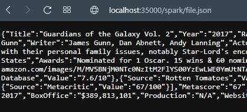
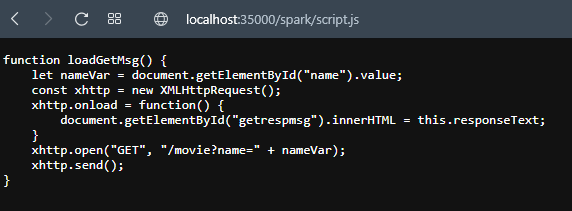
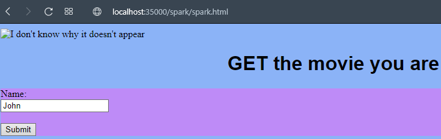
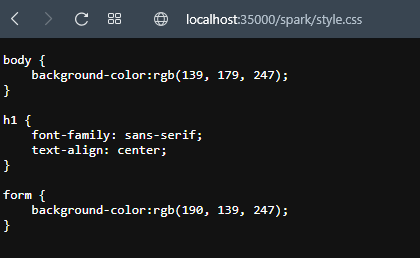

## Escuela Colombiana de Ingeniería
# MICROFRAMEWORKS WEB

Servidor web que soporta una funcionalidad similar a la de Spark permitiendo el registro de servicios get y post usando funciones lambda.

## Clonación del proyecto

Para descargar este proyecto, debe ejecutar el siguiente comando para descargar el proyecto:

```
git clone https://github.com/JuanPablo70/AREP-TALLER03.git
```

### Prerrequisitos

Para hacer uso de esta aplicación debe tener conocimientos de:
+ Java - Lenguaje de programación orientado a objetos.
+ Maven - Herramienta para automatizar la gestión y construcción de proyectos Java. 

### Ejecución de la aplicación

Para ejecutar la aplicación, debera en la línea de comandos (cmd) ubicarse en la carpeta donde se clonó el proyecto y ejecutar el siguiente comando:

```
mvn clean package exec:java -D "exec.mainClass"="edu.eci.arep.app.SparkApp"
```

Cuando se muestre en el mensaje "Listo para recibir ...", ingrese al link http://localhost:35000/spark/spark.html.

Si ya no va a hacer uno de la aplicación, cierre la línea de comandos.

## Test

Se probó el correcto funcionamiento del servidor haciendo peticiones GET a cada uno de los archivos (file.json, logo.png, script.js, spark.html y style.css).

Archivo json



Archivo js



Archivo html



Archivo css



Desafortunadamente, la foto sirve, pero no se ve en pantalla.

## Construido con

+ [Maven](https://maven.apache.org/) - Dependency Management

## Versión

1.0

## Autor

Juan Pablo Sánchez Bermúdez

## Descripción del proyecto

Con la estructura del proyecto anterior, se modificó su funcionamiento para poder construir un servidor web con una funcionalidad similar a la del microframework [Spark](https://sparkjava.com).

Para esto, se creó un paquete ```spark``` donde se tiene la clase ```Spark``` que al hacer uso del método get, se pueden implementar funciones lambda pasando como parámetro el path y route.

Lamentablemente no logré implementar el método POST.