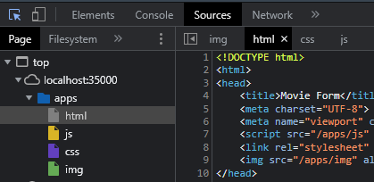

## Escuela Colombiana de Ingeniería
# DISEÑO Y ESTRUCTURACIÓN DE APLICACIONES DISTRIBUIDAS EN INTERNET

Servidor web que busca archivos html, javascript, css e imágenes desde el disco local.

## Clonación del proyecto

Para descargar este proyecto, debe ejecutar el siguiente comando para descargar el proyecto:

```
git clone https://github.com/JuanPablo70/AREP-TALLER02.git
```

### Prerrequisitos

Para hacer uso de esta aplicación debe tener conocimientos de:
+ Java - Lenguaje de programación orientado a objetos.
+ Maven - Herramienta para automatizar la gestión y construcción de proyectos Java. 

### Ejecución de la aplicación

Para ejecutar la aplicación, debera en la línea de comandos (cmd) ubicarse en la carpeta donde se clonó el proyecto y ejecutar el siguiente comando:

```
mvn clean package exec:java -D "exec.mainClass"="edu.eci.arep.webapps.FirstApp"
```

Cuando se muestre en el mensaje "Listo para recibir ...", ingrese al link http://localhost:35000/apps/html y al inspeccionar la página, podrá ver en ```sources``` como el servidor llama los archivos html, js, css e img.

Si ya no va a hacer uno de la aplicación, cierre la línea de comandos.

## Test

Se probó el correcto funcionamiento del servidor inspeccionando la página en el browser donde se puede ver cada uno de los archivos.



## Construido con

+ [Maven](https://maven.apache.org/) - Dependency Management

## Versión

1.0

## Autor

Juan Pablo Sánchez Bermúdez

## Descripción del proyecto


Como se puede ver en la imagen superior, un cliente ingresa una URL con un servicio en específico, el servidor busca el servicio en disco y cuando lo encuentra, responde con el archivo del servicio asociado.

Para esto se implementó una interfaz (RESTService) con dos métodos, uno que retorna el header del archivo y el otro que retorne el archivo del servicio que está leyendo (getHeader() y getResponse() respectivamente).

Se creó una clase para cada servicio que está disponible para este proyecto (ver imagen) que implementan RESTService, donde cada servicio tiene su respectivo ```Content-type``` y la ruta para acceder a dicho archivo.

Finalmente, desde la clase ```FirstApp``` se añaden cada uno de los servicios para que puedan ser accedidos por el usuario.